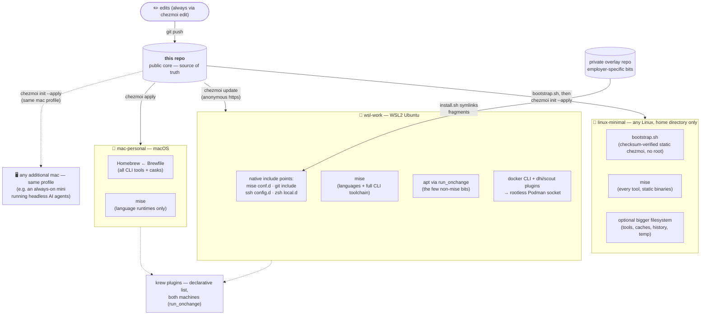

# dotfiles

[](LICENSE)

[](https://www.chezmoi.io)


Cross-machine dotfiles managed with [chezmoi](https://www.chezmoi.io).
One templated source, three very different kinds of machine, zero drift:

- **mac-personal** — personal MacBook (Homebrew, full freedom). This is a
  *profile*, not a single machine: any additional mac (say, an always-on mini
  running headless AI agents) joins with one `chezmoi init` and gets the
  identical setup.
- **wsl-work** — locked-down work laptop, WSL2 Ubuntu (mise, Podman, corporate network)
- **linux-minimal** — any Linux box where you get a home directory and nothing
  else: a jump host, a Raspberry Pi, a NUC. No root, no package manager, bash
  rather than zsh. chezmoi arrives through `bootstrap.sh`, every tool comes
  from mise as a static binary, and a nearly-full home is handled by moving the
  heavy parts to a bigger filesystem. See
  [linux-minimal](#linux-minimal-a-home-directory-and-nothing-else).

The `.zshrc` is ~85% identical between the two zsh machines; chezmoi keeps that shared core
single-sourced and isolates the differences in clearly-labelled template blocks.

## Design principles

- **One repo is the source of truth.** Live files are never edited directly;
  everything flows through the source repo, so either machine can be rebuilt
  from scratch with one command.
- **Deliberate package-manager split.** The Mac is all-in on Homebrew
  (`dot_Brewfile.tmpl`); the WSL box is all-in on [mise](https://mise.jdx.dev)
  (per-project language pinning, prebuilt binaries, no root), and so is the
  minimal Linux profile, which additionally forbids itself anything that needs
  root or a package manager. Tools declare where they live — nothing is
  installed ad hoc.
- **Declarative, idempotent provisioning.** apt packages, krew plugins, and
  docker CLI plugins are lists in `run_onchange_*` scripts: edit the list,
  apply, done. The docker plugins even self-update on every apply — comparing
  release tags first, and degrading gracefully offline so a sync never breaks.
- **Hostile-network survival.** SSH keepalives tuned for stateful corp
  middleboxes, fail-fast guards so an unreachable host costs 5 seconds instead
  of a 2-minute hang, and repo sync over plain HTTPS — the one protocol that
  corporate egress never mangles.
- **Employer bits stay out** — see [the overlay pattern](#work-overlay-keeping-employer-specific-bits-private) below.

## How it fits together



One `up` command per machine syncs everything above: core repo, overlay,
packages, and plugins.

## What's here

Every tool each machine installs is listed in **[TOOLS.md](TOOLS.md)** — grouped by category, one line each, with a link to its documentation. That
file is generated from the config files below and is never hand-edited,
so it cannot list something that is not actually installed.

| Source | Deploys to | Notes |
|---|---|---|
| `dot_zshrc.tmpl` | `~/.zshrc` | Shared core + per-machine blocks (pkg manager, certs, container runtime, aliases) |
| `dot_gitconfig.tmpl` | `~/.gitconfig` | delta pager; work identity layered in via `[include]` (not on linux-minimal) |
| `dot_bashrc.tmpl`, `dot_bash_profile.tmpl` | `~/.bashrc` | linux-minimal only: the bash profile — completions, fzf, history, prompt, `up`/`tools`/`footprint` |
| `dot_inputrc.tmpl`, `dot_vimrc.tmpl`, `dot_tmux.conf.tmpl` | `~/.inputrc` … | linux-minimal only: readline, vim paste toggle, a tmux config generated for the installed tmux version |
| `dot_config/bash/bc-compat.bash.tmpl` | shim | Stand-ins for the bash-completion helpers kubectl/helm completions expect |
| `dot_p10k.zsh` | `~/.p10k.zsh` | Powerlevel10k prompt (plain file) |
| `dot_Brewfile.tmpl` | `~/.Brewfile` | The Mac's entire toolchain, `brew bundle`-able |
| `dot_config/mise/config.toml.tmpl` | mise config | Languages everywhere; the full CLI toolchain on WSL |
| `dot_config/kind/*.yaml.tmpl` | kind configs | Cluster presets: default, no-CNI, Calico (iptables/eBPF) |
| `dot_default-python-packages` | mise | Default pip packages for every Python |
| `dot_local/bin/executable_tx` | `~/.local/bin/tx` | curl-only S3 file-transfer client (pairs with [s3tx](https://github.com/junior/s3tx)) |
| `private_dot_ssh/private_config` | `~/.ssh/config` | WSL-only: overlay include + keepalives for stateful-firewall networks |
| `run_onchange_install-apt-packages.sh.tmpl` | — | Declarative apt list (WSL) |
| `run_onchange_install-krew-plugins.sh.tmpl` | — | Declarative kubectl/krew plugin list (mac and WSL; on linux-minimal only when asked for via `extras`; bootstraps krew on Linux, skips without git) |
| `run_before_relocate-bigdisk.sh.tmpl` | — | linux-minimal: moves tool installs, caches and history to a bigger filesystem and links them back |
| `run_after_install-mise.sh.tmpl` | — | linux-minimal: checksum-verified mise, then every declared tool and its bash completion, reconciled on every apply |
| `run_after_setup-blesh.sh.tmpl` | — | linux-minimal: ble.sh, pinned and checksum-verified, for fish-style autosuggestions in bash; also splits `fzf --bash` into the files ble.sh's fzf integration reads |
| `dot_local/bin/executable_oscopy`, `executable_tmux-tidy` | `~/.local/bin/` | linux-minimal: copy to the clipboard of the machine you sit at over OSC 52; tidy stray tmux sessions |
| `bootstrap.sh` | — | Installs a static chezmoi with no package manager and runs the init; `--bigdisk DIR` keeps even that off a small home |
| `run_onchange_install-ebpf-tools.sh.tmpl` | — | bpftool & friends (WSL; upstream tarball quirks handled) |
| `run_onchange_install-wsl-integration.sh.tmpl` | — | WSL⇄Windows niceties |
| `run_onchange_install-devin.sh.tmpl` | — | Devin CLI (WSL) |
| `run_setup-docker-cli.sh.tmpl` | — | docker CLI against rootless Podman + self-updating `dhi`/`scout` plugins (WSL) |
| `run_pin-self-updating-casks.sh.tmpl` | — | Pins casks that update themselves, so brew never fights their updater (mac) |
| `gen-tools.py` | `TOOLS.md` | Regenerates the tool inventory; `--check` fails if the file is stale |
| `.chezmoi.toml.tmpl` | chezmoi config | Prompts once on init: the machine, and for linux-minimal a bigger filesystem and optional extras |

## First-time setup

1. Install chezmoi — `brew install chezmoi` (mac) or `mise use -g chezmoi` (WSL).
   On a host with no package manager, `bootstrap.sh` does it, checksum-verified
   and without root, then runs step 2 for you:
   ```sh
   curl -fsSLO https://raw.githubusercontent.com/junior/dotfiles/main/bootstrap.sh
   sh bootstrap.sh              # add --bigdisk DIR when the home is small
   ```
2. Initialise from this repo:
   ```sh
   chezmoi init --apply https://github.com/junior/dotfiles.git
   ```
   chezmoi prompts once for the machine (`mac-personal`, `wsl-work` or
   `linux-minimal`), then writes `~/.zshrc` or `~/.bashrc`, `~/.gitconfig`, etc.
   linux-minimal asks two more questions: a directory on a bigger filesystem
   for tools and caches (blank keeps everything in `$HOME`), and optional
   extras (`krew` for kubectl plugins).
3. Reload: `exec zsh`, or `exec bash -l` on linux-minimal.

Forking this for yourself? Grep for `junior` and swap in your own identity,
then follow the same flow against your fork.

## Daily workflow

| Action | Command |
|---|---|
| Edit a managed file | `chezmoi edit ~/.zshrc` |
| Preview pending changes | `chezmoi diff` |
| Apply pending changes | `chezmoi apply` |
| Pull a manual edit back into source | `chezmoi re-add ~/.p10k.zsh` |
| Sync from the remote (other machine) | `chezmoi update`; on linux-minimal use `up`, which re-runs `chezmoi init` so a changed config template is picked up |
| Open the source repo | `chezmoi cd` |
| Everything at once: repo, overlay, packages, plugins | `up` |
| See the toolchain by category | `tools` |
| What the setup occupies, and where (linux-minimal) | `footprint` |
| Refresh `TOOLS.md` after adding a tool | `./gen-tools.py` (from `chezmoi cd`) |

Templated files (`*.tmpl`) must be edited via `chezmoi edit` — editing the live
file and `re-add`-ing won't work because chezmoi can't un-template. Plain files
(like `dot_p10k.zsh`) re-add fine.

## linux-minimal: a home directory and nothing else

The third profile is for machines you do not administer: a jump host, or a
small box like a Raspberry Pi or a NUC where you would rather not depend on
the distro. It assumes only bash, git optionally, and a writable home.

What it does differently:

- **Nothing needs root or a package manager.** chezmoi is installed by
  `bootstrap.sh` from a checksum-verified release, using the static musl build
  because the glibc one needs a newer libc than enterprise distros ship. Every
  tool is a static binary from mise, and completions are generated from the
  tools themselves because bash-completion is usually not installed.
- **A small home stays small.** Answer the "bigger filesystem" prompt with a
  directory you own on the large disk (say, `/data/$USER`). Tool installs,
  caches, kubectl's discovery cache, shell history and temp files go there;
  `~/.local/share` and `~/.cache` become links; large binaries in `~/.local/bin`
  are parked there and linked back. chezmoi's own scripts, and everything they
  download, use that filesystem too, which matters on hardened hosts that
  mount `/tmp` noexec. The home ends up holding a few hundred KB of config.
- **The tmux config is generated for the tmux found at apply time**, because
  the mouse, copy-mode and styling syntax all changed between 2.1 and 2.9 and
  a jump host may well run 2.7.
- **Optional extras** are a comma-separated answer at init. `krew` adds the
  kubectl plugin manager and the plugin list from the other machines; it needs
  git, and is skipped with a message on hosts that have none.
- **Terminal comforts that survive ssh and tmux:** fish-style autosuggestions
  from history via [ble.sh](https://github.com/akinomyoga/ble.sh) (grey text
  after the cursor, Right arrow accepts), Up/Down search history by what you
  typed, Ctrl-R fuzzy history, a prompt with the current kube context,
  `oscopy` to put output on the clipboard of the machine you are sitting at,
  `tmux-tidy` for stray sessions, and `jhelp` to list all of it.

Daily use is one command, `up`: pull, regenerate the config, apply, sync the
private overlay if present, update mise tools and krew plugins, then print the
toolchain by category and `footprint`, what the setup occupies and where. It
reports only what changed; a run where nothing moved prints "all current".
mise itself is pinned in the repo rather than self-updated, so upgrading it
means bumping the pin; the same goes for ble.sh.

## Work overlay (keeping employer-specific bits private)

This public repo is the **core**. Anything employer-specific — internal tool
registries, work email, corporate git hosts, work-only shell tooling — lives in
a separate **private overlay** repo, never here. The two are joined entirely by
each tool's *native* include mechanism, so the public core stays standalone and
clonable by anyone:

| Layer | Public core | Private overlay |
|---|---|---|
| mise tools | `~/.config/mise/config.toml` | `~/.config/mise/conf.d/*.toml` (mise auto-merges) |
| git identity | personal default | `~/.gitconfig.local` (via `[include]`) |
| ssh hosts | `Include ~/.ssh/config.d/*` | files in `~/.ssh/config.d/` |
| shell | sources `~/.config/zsh/local.d/*.zsh` | files in `~/.config/zsh/local.d/` |

The overlay is a plain repo with an `install.sh` that symlinks its fragments
into those paths; an `up` shell function keeps everything (core, overlay,
packages) in sync with one command. Result: one public repo to share, zero
employer details in it, and a work machine that's still fully configured.

## Bootstrapping a brand-new repo from this layout

```sh
chezmoi init                          # creates ~/.local/share/chezmoi
cp -r ./* ./.chezmoi* "$(chezmoi source-path)"/
chezmoi apply
cd "$(chezmoi source-path)"
git init && git add . && git commit -m "initial dotfiles" && git push -u origin main
```

## License

[MIT](LICENSE)
