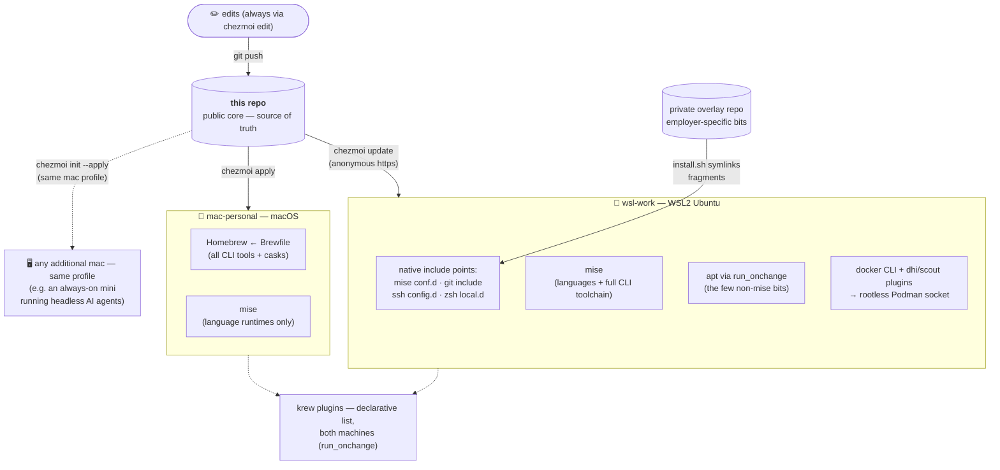

# dotfiles

[](LICENSE)

[](https://www.chezmoi.io)


Cross-machine dotfiles managed with [chezmoi](https://www.chezmoi.io).
One templated source, two very different machines, zero drift:

- **mac-personal** — personal MacBook (Homebrew, full freedom). This is a
  *profile*, not a single machine: any additional mac (say, an always-on mini
  running headless AI agents) joins with one `chezmoi init` and gets the
  identical setup.
- **wsl-work** — locked-down work laptop, WSL2 Ubuntu (mise, Podman, corporate network)

The `.zshrc` is ~85% identical between the two; chezmoi keeps that shared core
single-sourced and isolates the differences in clearly-labelled template blocks.

## Design principles

- **One repo is the source of truth.** Live files are never edited directly;
  everything flows through the source repo, so either machine can be rebuilt
  from scratch with one command.
- **Deliberate package-manager split.** The Mac is all-in on Homebrew
  (`dot_Brewfile.tmpl`); the WSL box is all-in on [mise](https://mise.jdx.dev)
  (per-project language pinning, prebuilt binaries, no root). Tools declare
  where they live — nothing is installed ad hoc.
- **Declarative, idempotent provisioning.** apt packages, krew plugins, and
  docker CLI plugins are lists in `run_onchange_*` scripts: edit the list,
  apply, done. The docker plugins even self-update on every apply — comparing
  release tags first, and degrading gracefully offline so a sync never breaks.
- **Hostile-network survival.** SSH keepalives tuned for stateful corp
  middleboxes, fail-fast guards so an unreachable host costs 5 seconds instead
  of a 2-minute hang, and repo sync over plain HTTPS — the one protocol that
  corporate egress never mangles.
- **Employer bits stay out** — see [the overlay pattern](#work-overlay-keeping-employer-specific-bits-private) below.

## How it fits together



One `up` command per machine syncs everything above: core repo, overlay,
packages, and plugins.

## What's here

| Source | Deploys to | Notes |
|---|---|---|
| `dot_zshrc.tmpl` | `~/.zshrc` | Shared core + per-machine blocks (pkg manager, certs, container runtime, aliases) |
| `dot_gitconfig.tmpl` | `~/.gitconfig` | delta pager; work identity layered in via `[include]` |
| `dot_p10k.zsh` | `~/.p10k.zsh` | Powerlevel10k prompt (plain file) |
| `dot_Brewfile.tmpl` | `~/.Brewfile` | The Mac's entire toolchain, `brew bundle`-able |
| `dot_config/mise/config.toml.tmpl` | mise config | Languages everywhere; the full CLI toolchain on WSL |
| `dot_config/kind/*.yaml.tmpl` | kind configs | Cluster presets: default, no-CNI, Calico (iptables/eBPF) |
| `dot_default-python-packages` | mise | Default pip packages for every Python |
| `dot_local/bin/executable_tx` | `~/.local/bin/tx` | curl-only S3 file-transfer client (pairs with [s3tx](https://github.com/junior/s3tx)) |
| `private_dot_ssh/private_config` | `~/.ssh/config` | WSL-only: overlay include + keepalives for stateful-firewall networks |
| `run_onchange_install-apt-packages.sh.tmpl` | — | Declarative apt list (WSL) |
| `run_onchange_install-krew-plugins.sh` | — | Declarative kubectl/krew plugin list (all machines; bootstraps krew on Linux) |
| `run_onchange_install-ebpf-tools.sh.tmpl` | — | bpftool & friends (WSL; upstream tarball quirks handled) |
| `run_onchange_install-wsl-integration.sh.tmpl` | — | WSL⇄Windows niceties |
| `run_onchange_install-devin.sh.tmpl` | — | Devin CLI (WSL) |
| `run_setup-docker-cli.sh.tmpl` | — | docker CLI against rootless Podman + self-updating `dhi`/`scout` plugins (WSL) |
| `.chezmoi.toml.tmpl` | chezmoi config | Prompts once for machine identity on init |

## First-time setup

1. Install chezmoi — `brew install chezmoi` (mac) or `mise use -g chezmoi` (elsewhere).
2. Initialise from this repo:
   ```sh
   chezmoi init --apply https://github.com/junior/dotfiles.git
   ```
   chezmoi prompts once for the machine (`wsl-work` or `mac-personal`), then
   writes `~/.zshrc`, `~/.gitconfig`, etc.
3. Reload: `exec zsh`

Forking this for yourself? Grep for `junior` and swap in your own identity,
then follow the same flow against your fork.

## Daily workflow

| Action | Command |
|---|---|
| Edit a managed file | `chezmoi edit ~/.zshrc` |
| Preview pending changes | `chezmoi diff` |
| Apply pending changes | `chezmoi apply` |
| Pull a manual edit back into source | `chezmoi re-add ~/.p10k.zsh` |
| Sync from the remote (other machine) | `chezmoi update` |
| Open the source repo | `chezmoi cd` |

Templated files (`*.tmpl`) must be edited via `chezmoi edit` — editing the live
file and `re-add`-ing won't work because chezmoi can't un-template. Plain files
(like `dot_p10k.zsh`) re-add fine.

## Work overlay (keeping employer-specific bits private)

This public repo is the **core**. Anything employer-specific — internal tool
registries, work email, corporate git hosts, work-only shell tooling — lives in
a separate **private overlay** repo, never here. The two are joined entirely by
each tool's *native* include mechanism, so the public core stays standalone and
clonable by anyone:

| Layer | Public core | Private overlay |
|---|---|---|
| mise tools | `~/.config/mise/config.toml` | `~/.config/mise/conf.d/*.toml` (mise auto-merges) |
| git identity | personal default | `~/.gitconfig.local` (via `[include]`) |
| ssh hosts | `Include ~/.ssh/config.d/*` | files in `~/.ssh/config.d/` |
| shell | sources `~/.config/zsh/local.d/*.zsh` | files in `~/.config/zsh/local.d/` |

The overlay is a plain repo with an `install.sh` that symlinks its fragments
into those paths; an `up` shell function keeps everything (core, overlay,
packages) in sync with one command. Result: one public repo to share, zero
employer details in it, and a work machine that's still fully configured.

## Bootstrapping a brand-new repo from this layout

```sh
chezmoi init                          # creates ~/.local/share/chezmoi
cp -r ./* ./.chezmoi* "$(chezmoi source-path)"/
chezmoi apply
cd "$(chezmoi source-path)"
git init && git add . && git commit -m "initial dotfiles" && git push -u origin main
```

## License

[MIT](LICENSE)
